# `read_print_23.pl` — Code Structure, Audit, and Python Port Plan

**Source:** `read_print_23.pl` (2017 lines, Perl 5, single file)
**Date of analysis:** 2026-07-29
**Status of analysis:** static read-through of the complete file. No execution (no Perl/Python run access in this session). Every line reference below was taken from the file as it stands.

This document serves three purposes:

1. **Audit** — what the program does and where it does not do what it claims (§4).
2. **Port plan** — the target Python architecture (§5–§7).
3. **Work breakdown** — self-contained tasks that sub-agents can pick up independently (§8).

---

## 1. What the program is

`read_print_23.pl` is a **long-read structural-variation visualiser**. Given

- a reference sequence (GenBank `.gb` or FASTA `.fa`), and
- a BLAST alignment of long reads (Oxford Nanopore / PacBio) against that reference, in BLAST's `BTOP` tabular format,

it classifies every read by *how it maps* — contiguously, or split into pieces — and draws a multi-page, wide-format map: the reference as an x-axis, every read as a horizontal line above (plus strand) or below (minus strand) the axis, with arrowheads and colour encoding the type of mapping discontinuity. Output is one concatenated PostScript file converted to PDF by Ghostscript's `ps2pdf`.

The scientific point: reads whose two halves map far apart, or in opposite orientation, or to a different contig, are evidence of **structural variation, inversions, transposition, phage excision, or circularity** in the sample relative to the reference. The map makes those reads visible as a class rather than one at a time.

Expected invocation:

```bash
perl read_print_23.pl AP027148.gb DRR325755.btop -x 10
```

BTOP file produced by:

```bash
blastn -db blastdb -query all_reads.fa -out file.btop \
  -outfmt '6 delim=<TAB> qseqid sframe qstart qend sstart send qlen sseqid btop'
```

### 1.1 Input record contract (BTOP columns)

The entire program depends on this column order. It is never validated.

| Idx | BLAST field | Meaning in code | Notes |
|-----|-------------|-----------------|-------|
| 0 | `qseqid` | read name | rewritten to `R_<digits>` at L498–499 |
| 1 | `sframe` | strand, `+1` / `-1` | used directly as the sign of the y coordinate |
| 2 | `qstart` | match start **in the read** | |
| 3 | `qend` | match end in the read | |
| 4 | `sstart` | match start **on the reference** | `sstart > send` when `sframe == -1` |
| 5 | `send` | match end on the reference | |
| 6 | `qlen` | total read length | used for `min_read_length` and coverage |
| 7 | `sseqid` | reference accession / contig | must match the accession in the reference file |
| 8 | `btop` | BLAST alignment trace string | **parsed out but never used anywhere** (see B34) |

One read produces one or more lines (HSPs). **Lines for the same read must be consecutive** — the grouping logic in `Sort_reads` is a "did the name change?" comparison, not a real group-by (see B01).

---

## 2. Execution pipeline

```mermaid
flowchart TD
    A["define_PS_settings()<br/>colours + arrow macros"] --> B["READ_PARAMETERS()<br/>GetOptions, defaults, positional args"]
    B --> C["OPEN_DEBUG() if -d"]
    C --> D["OPEN_FILES()"]
    D --> D1["readgb() or readfa()<br/>-> %seqs, %seq_length"]
    D1 --> D2["annotation_extract() -> extanno()<br/>-> @extract_anno  (GenBank only)"]
    D2 --> E["PS_init()<br/>open one .ps file per contig-page"]
    E --> F["Init_mapstrings()<br/>k_max blank lanes per contig, per strand"]
    F --> G["Print_annot()  (GenBank only)"]
    G --> H["Sort_reads()<br/>stream BTOP, group by read"]
    H --> H1["_process_bt_read()<br/>drop overlapping/repeat HSPs"]
    H1 --> H2["_process_multi_quest()<br/>classify: single / short-div / long-div"]
    H2 --> I["extract_reads()  (only if -e given)"]
    I --> J["Print_reads()<br/>lane packing + PostScript drawing"]
    J --> K["PS_finish()"]
    K --> K1["PRINT_parameters()<br/>front page: params, legend, stats"]
    K1 --> K2["concatenate all .ps -> out.ps"]
    K2 --> K3["system('ps2pdf') -> out.pdf"]
    K3 --> L["Report_Analysis()<br/>out_Analysis.txt"]
```



Main body: L55–L111. Everything after L114 is subroutines.

---

## 3. Code map

### 3.1 Global state

All state is global. There are no objects except a small ad-hoc `PS` blessed hash (L1548–L1601).

| Variable | Type | Written by | Read by | Purpose |
|---|---|---|---|---|
| `%opt`, `%opt_default` | hash | `READ_PARAMETERS` L124–170 | everywhere | CLI parameters |
| `@PARAM_META` | array of hash | L25–36 (literal) | `READ_PARAMETERS`, `PRINT_parameters`, `usage` | single source of truth for the *numeric* options only |
| `%seqs` | acc → full sequence string | `readgb`/`readfa` | **only `length()`** | wastes memory (B26) |
| `%seq_length`, `$seq_length_total` | acc → int | `readgb`/`readfa` | page count, circularity, coverage | |
| `@seqs` | accessions sorted by length desc | L261, L330, L460 | every drawing loop | iteration order |
| `%gb_annot` | acc → raw pre-`ORIGIN` text | `readgb` | `annotation_extract` | |
| `@extract_anno` | `"acc\tstrand\tbeg\tend\ttype\tname\tgroup"` | `annotation_extract` | `Print_annot` | |
| `$organism`, `$bio_project`, `$bio_sample`, `$sra`, `$asm_meth`, `$seq_tech` | string | `readgb` L281–289 | front page, `Report_Analysis` | may be **undef** (B13) |
| `%bt_r_single` | acc → [btop line, …] | `_process_bt_read`, `_process_multi_quest` | `Print_reads` | undivided reads |
| `%bt_r_multi_short` | acc → [btop line + `\t<circle-tag>`, …] | `_process_multi_quest` | `Print_reads` | short-distance divided |
| `%bt_r_multi_long` | acc → [btop line + `\t<circle-tag>`, …] | `_process_multi_quest` | `Print_reads` | long-distance divided |
| `%read_extract` | acc → kb-window → [{read,start,end}] | `Sort_reads` L490–495 | `get_reads_in_region` | built unconditionally (B25) |
| `%mapstring_plus/minus` | acc → [lane index] → string of `' '`/`'-'` | `Init_mapstrings`, `Print_reads` | lane packing | O(genome) strings × ~238 lanes × 2 |
| `%map_pages` | acc → last page index | `OPEN_FILES` L264, `PS_init` L659 | every page-name computation | |
| `%PSFH` | page name → filehandle | `PS_init` | all drawing | all pages open simultaneously |
| `%color`, `%arrow` | int/name → PostScript fragment | `define_PS_settings` | drawing | |
| `%cont_cov` | acc → summed matched bases | `Print_reads` | `Report_Analysis` | inconsistent units (B10) |
| `$read_tot`, `$single_read_count`, `$short_div_read`, `$long_div_read`, `$arrow_count` | counters | `Print_reads`, `_process_multi_quest` | front page, `Report_Analysis` | mixed units (reads vs segments) |
| `%debug` | name → filehandle | `OPEN_DEBUG` | scattered `print {…} if …` | 9 debug files |
| `$axis_width` | `10000 * page_scale` | L67 | page arithmetic | PS units per page |
| `$k_max` | `3700/line_space - 8` | L68 | lane packing | **fractional** by default (238.67) |

### 3.2 Subroutine reference

| Sub | Lines | Responsibility | Notes for the port |
|---|---|---|---|
| `READ_PARAMETERS` | 120–219 | defaults, `GetOptions`, positional args, existence checks | → `argparse` + a frozen `Params` dataclass |
| `fmt_opt` | 221–230 | pretty-print a possibly-arrayref option | → `__str__` on the dataclass |
| `OPEN_FILES` | 234–269 | sniff reference format, dispatch parser, derive `$sample`, compute `%map_pages`, open BTOP | split: format sniffing ≠ page arithmetic ≠ file opening |
| `readgb` | 273–335 | parse GenBank: header metadata, per-`LOCUS` sequence and annotation text | keep only lengths, stream the file |
| `annotation_extract` | 337–365 | split annotation text into per-gene feature blocks | |
| `extanno` | 367–431 | one feature block → `strand, beg, end, type, name, group` | the classification (`RNA`/`phage`/`IS`/`hyp`/`pseudo`) lives here |
| `readfa` | 433–465 | parse FASTA: names + lengths | |
| `Sort_reads` | 469–537 | stream BTOP, apply `min_read_length`, build the extraction index, rename reads, group by read, apply `cov_max` | the hot loop |
| `_process_bt_read` | 539–584 | within one read: collapse near-duplicate repeat HSPs, then greedily keep non-overlapping HSPs in file order | O(read length) per HSP (B27) |
| `_process_multi_quest` | 586–654 | classify the surviving HSP set: single / short-div / long-div; tag `Circle` / `Contig_Join` / `C` | the scientific core |
| `PS_init` | 658–797 | create every page file, emit the PS prologue, frame, title, arrow macros, x-axis ticks | → replace with a PDF canvas |
| `PRINT_parameters` | 799–1077 | build the front page (parameters, legend, project info, contig lengths, statistics) | uses the `PS` helper + a bespoke `\t`/`\x1F` mini-format |
| `REPORT_FOOTER_PS` | 1079–1115 | provenance stamp (time, host, cwd, command line) | |
| `Print_annot` | 1118–1172 | draw GenBank features under the axis, in up to 3 stacked rows per strand | |
| `Init_mapstrings` | 1175–1186 | allocate the blank lane strings | → replaced by interval-based packing |
| `Print_reads` | 1188–1540 | three near-duplicate blocks (long-div, short-div, single): lane packing, page splitting, line/arrow/label drawing, coverage accumulation | **~350 lines, the main duplication target** |
| `PS`, `PS::*` | 1548–1601 | tiny PostScript text-layout helper (cursor, `text`, `row2`, `hr`, `title`, `color`, `font`) | → a real layout helper |
| `PS_all` | 1603–1613 | broadcast a PS fragment to every content page | |
| `PS_finish` | 1616–1671 | `showpage`, close, concatenate, back up an existing PDF, run `ps2pdf` | |
| `define_PS_settings` | 1673–1699 | colour and arrow definitions | → a `theme.py` constants module |
| `extract_reads` | 1706–1834 | pull region-specific reads out of a FASTA/FASTQ(.gz) file | |
| `get_reads_in_region` | 1836–1860 | kb-window index lookup + dedup | |
| `usage` | 1872–1926 | help text | |
| `Report_Analysis` | 1928–1958 | one-line-per-run TSV for batch aggregation | |
| `open_maybe_gz`, `OPEN_DEBUG`, `logmsg`, `min`, `max`, `text`, `num` | 1965–2016 | helpers | `num` is unused |

### 3.3 The classification algorithm (must be preserved exactly)

This is the scientific content. Any port must reproduce it bit-for-bit before it is allowed to improve it.

**Step 1 — per-HSP filter** (`Sort_reads`)
- Drop the line if `qlen < min_read_length`.
- Consider the HSP only if `qend - qstart > 100` (hardcoded; see B05).

**Step 2 — repeat collapse** (`_process_bt_read` L556–567)
For `j >= 2`, if the current HSP's *query* length is within 50 bp of the previous HSP's query length, the two are treated as alternative placements of the same repeat, and the one starting *further* from the read's first reference position is dropped (implemented as `$bt_read[$j-1] = $bt_read[$j]`, which duplicates and lets step 3 discard it).

**Step 3 — greedy non-overlapping selection** (L571–582)
Walk the HSPs in file order. Keep an HSP only if no base of its *query* interval is already claimed. On keeping it, claim `[qstart + tol, qend - tol]` where `tol = micro_match_length / 4`. The tolerance lets short repeats at the junctions be re-used.

**Step 4 — classification** (`_process_multi_quest`)
- 0 surviving HSPs → nothing.
- 1 surviving HSP → **undivided** (`%bt_r_single`).
- ≥2 surviving HSPs:
  - `map_span  = max(sstart,send over all HSPs) - min(...)`
  - `read_span = max(qstart,qend over all HSPs) - min(...)`
  - `l = |map_span - read_span|` — how much reference the read skips over relative to its own length.
  - `l < min_match_length` → **short-distance divided** (indels, small rearrangements).
  - `l >= min_match_length` → **long-distance divided** (structural), and only segments with `|sstart - send| > min_match_length` are drawn.
  - Junction tag: `Contig_Join` if any HSP maps to a different accession than the first; else `Circle` if `|contig_length - map_span| < 20` (the read bridges the origin, i.e. the replicon is circular); else `C`.

**Step 5 — inversion detection** (`Print_reads` L1391–1400)
Within a short-divided read, any segment whose strand differs from the read's *first* segment is drawn in red with a rotated arrow and increments `$arrow_count`.

---

## 4. Audit — findings

Severity key: **C** = wrong scientific output or crash · **H** = wrong behaviour, user-visible · **M** = robustness / correctness edge case · **L** = cosmetic, dead code · **P** = performance.

### 4.1 Critical

| ID | Sev | Location | Finding |
|---|---|---|---|
| **B01** | C | L498–499 | `$btop_read[0] =~ /\w+[\._](\d+)/; $btop_read[0] = "R_".$1;` — the match is **not checked**. On failure `$1` retains the *previous* read's capture, so the current read silently inherits the previous read's identity and its HSPs are merged into the previous group. ONT read names are UUIDs (`0a1b2c3d-...`), which never match this pattern → on a real ONT run **every read collapses into one group**. Also `SRR1.100` and `SRR2.100` both become `R_100`. |
| **B02** | C | L137 + L109 | `report_analysis => []` — an empty arrayref is **truthy** in Perl. `Report_Analysis() if $opt{report_analysis};` therefore always fires. The `-a` flag does nothing; `*_Analysis.txt` is always written. |
| **B03** | C | L1210, L1232, L1326, L1343, L1471, L1492 | Lane search: `while (substr($mapstring_*{$key}[$k], …) =~ /-/) { $k++ }`. The clamp `$k = min($k,$k_max)` happens **after** the loop. When all `k_max` (≈238) lanes are occupied, `$k` reaches 239, the array element is `undef`, and `substr(undef,…)` is **fatal** under `use warnings FATAL => 'uninitialized'` (L10). High-coverage datasets crash. This is almost certainly why `-x/--cov-max` exists. |
| **B04** | C | L1337–1338, L1355–1356 | In the short-divided block, `@map` is the loop variable of the *preceding* grouping loop (L1289–1310) and therefore holds the **last record of the whole contig**. `$map[8]` is then used to pick the arrow for *every* read in the print loop. `Circle` / `Contig_Join` decoration is applied to the wrong reads — all-or-nothing per contig. |
| **B05** | C | L501 vs L28, L570 | The documented option `-y --micro-match-length` (default 100) does **not** control the minimum HSP length — that test is hardcoded `> 100` with the intended expression commented out on the same line. The option only affects `$tol = micro_match_length/4`. Changing `-y` therefore produces a surprising, undocumented effect. |
| **B06** | C | L1712–1716 | `extract-reads-list_*.txt` gets a two-line header and nothing else — `@btop_list` is never written to `$fh_list`. The advertised list of extracted reads with coordinates does not exist. |
| **B07** | C | L1723–1726 | Format sniffing reads one line then `seek($fh,0,0)`. For a `.gz` input the handle is a **pipe**; `seek` fails, the return value is unchecked, and parsing resumes at line 2 — the first record is lost and (for FASTQ) the 4-line phase is broken for the whole file. |
| **B08** | C | L1969, L79–85 | `open(my $fh,"-|","gzip -dc $file")` — `$file` is interpolated into a shell command unquoted (breaks on Windows paths with spaces; shell-injectable). Meanwhile `$have_gunzip` is probed at startup and **never used**, so the pure-Perl `IO::Uncompress::Gunzip` path that would work on Windows is dead. |
| **B09** | C | L288, L706, L984, L1071, L1168, L1272, L1277, L1413, L1447, L1450, L1524, L1529 | **No PostScript string escaping.** Every label is emitted as `(text) show`. Any `(`, `)` or `\` in a read name, FASTA header, organism, product name, file path or command line produces malformed PostScript → `ps2pdf` fails or silently truncates the document. L288 (`$seq_tech =~ s/[()]/ /`) is an attempt at a fix but is **missing `/g`**, so only the first parenthesis is removed and the closing one still breaks the file. |
| **B10** | C | L1201, L1315, L1462 | Coverage accounting is inconsistent: long-divided and undivided reads add `|sstart-send|` **per HSP**, but short-divided reads add `sr_max - sr_min` — the **whole span including the skipped reference**. `%cont_cov`, and therefore the coverage column of `*_Analysis.txt`, is inflated by an amount that depends on the sample's rearrangement load. |
| **B11** | C | L523, L527–529 | The accessions seen in the BTOP file (`%btop_acc`) are collected and written to the debug log with the note "They must match" — but **never actually compared** to `@seqs`. A version-suffix mismatch (`NC_000913` vs `NC_000913.3`) yields blank pages and a zero-read report, with no error. |

### 4.2 High

| ID | Sev | Location | Finding |
|---|---|---|---|
| **B12** | H | L239–249, L93 | If the reference file starts with neither `>` nor `LOCUS `, `$ref_seq_type` is left undef and L93 (`if $ref_seq_type eq "gb"`) dies with an uninitialized-value error instead of a useful message. |
| **B13** | H | L291–296, L975–980 | GenBank metadata fields are undef when absent (very common for `BioProject:`, `Sequence Read Archive:` in non-NCBI-submitted records) → fatal at the `print "ORG: $organism"` line under `FATAL => 'uninitialized'`. |
| **B14** | H | L252–258 | The BTOP filename must literally contain `btop` or the program prompts on **STDIN in a loop** (fatal for batch use). `$opt{btop_file} =~ /(\w+)\.btop/; $sample = $1;` is unchecked → undef `$sample` for e.g. `reads-1.btop` (a `-` is not `\w`) → fatal. A path typed at the prompt is never existence-checked. |
| **B15** | H | L488, L627, L644 | `min_match_length` controls **three unrelated things**: the granularity filter of the extraction index, the short/long divided threshold, and the minimum drawn segment of a long-divided read. Tuning one breaks the other two. |
| **B16** | H | L504–507 | `cov_max`: the increment uses `$btop_read[6]` — the qlen of the **incoming** read, not the one just completed; and the `return` abandons `@bt_read` (the pending group is dropped) and skips the accession log at L527. |
| **B17** | H | L1403–1414 | A short-divided segment that straddles a page boundary is drawn in the default colour with no inversion check — inverted segments crossing a page get **no red marker and are not counted** in `$arrow_count`. The author's own comment reads "missing arrow here? What going on here?". |
| **B18** | H | L34 vs L155 | Help and the front-page parameter table advertise `-v --space2reads`, but `GetOptions` registers `space-to-reads|v`. `--space2reads` is rejected. |
| **B19** | H | L1946, L1953 | `*_Analysis.txt`: the summary row has **14** columns; per-contig rows emit 15 empty fields and put the accession in column **16**. No header row is written despite the comment at L1929–1933 describing one. Any downstream parser will mis-align. |
| **B20** | H | L561–563 | `abs($multi_rd_pr[4] - $m_rd_start) > abs($multi_rd[4] - $m_rd_start + $multi_rd[6])` adds a **read length** to a **reference-coordinate difference** — dimensionally incoherent, and precedence makes it `(sstart - start) + qlen`. The "removal" is `$bt_read[$j-1] = $bt_read[$j]`, i.e. duplication that relies on the later overlap filter to drop the copy. Fragile and undocumented. |

### 4.3 Medium

| ID | Sev | Location | Finding |
|---|---|---|---|
| **B21** | M | L442–444 | FASTA header parsing: `/\|(\S+)/` with greedy `\S+` turns `>gi\|12345\|ref\|NC_000913.3\|` into the accession `12345|ref|NC_000913.3|`. |
| **B22** | M | L324 | `s/[^acgtACGTnN]//g` silently deletes IUPAC ambiguity codes (R, Y, S, W, K, M, B, D, H, V) → the stored contig length is short by that count, shifting the `Circle` test and the page count. |
| **B23** | M | L1160–1168, L1165 | An annotation spanning a page boundary is drawn past the page edge and clipped, with no continuation on the next page. A malformed coordinate makes `$pp` exceed the page range and triggers a bare `die` with a debug-style message. |
| **B24** | M | L345, L391 | Feature blocks only begin at `^\s{5}gene\b`. `misc_feature`, `repeat_region`, `mobile_element` and orphan `CDS` records get folded into the preceding gene block, so their `/product` can retag that gene. `ncRNA`, `tmRNA`, `misc_RNA` are not recognised by the `(tRNA|rRNA|RNA)` alternation. |
| **B38** | M | L570, L578 | `tol = micro_match_length/4` can exceed half the HSP length, inverting the reserve range `qstart+tol .. qend-tol`. Perl silently iterates zero times; **Python must guard this explicitly**. |
| **B39** | M | L505, L1944, L1952 | No zero guard on `$seq_length_total` or `$seq_length{$key}` (empty FASTA record, or a reference that parsed to nothing). |
| **B31** | M | L1296 + L1306 | The first segment of every short-divided read has its coordinates pushed into `@sr_mark` **twice**, drawing duplicate tick marks. |
| **B36** | M | L1198, L1459 | `while ($bt_r_multi_long{$key}[$c])` autovivifies the key and terminates on any falsy element instead of iterating the array. |
| **B37** | M | L264 | `map_pages = int((len/map_scale + map_scale)/axis_width)` adds `map_scale` (a scale factor) to a scaled length — units do not match. The intent is clearly the read-label overhang, which is `$opt{space}`. |
| **B35** | M | L1003 | `$read_tot ||= 1` mutates the global, so a zero-read run reports **1** total read in the analysis TSV. |

### 4.4 Performance

| ID | Location | Finding | Cost |
|---|---|---|---|
| **B25** | L490–495 | `%read_extract` is built for **every** qualifying HSP whether or not `-e` was given — one hash entry per kilobase of every match. | Dominant memory consumer on a real dataset; pure waste in the default case. |
| **B26** | L318, L324, L451 | Full reference sequences are held in `%seqs`, but the content is **never used** — only `length()`. | Whole genome in RAM twice (raw + cleaned). |
| **B27** | L574–578 | Per-base loops `for my $k ($qstart .. $qend)` over the read coordinates, for every HSP of every multi-HSP read. | O(read length) per HSP; a 100 kb ONT read costs 100 000 iterations per HSP. Replace with interval arithmetic. |
| **B28** | L1210, L1232, L1326, L1343, L1471, L1492 | Lane packing does a linear `substr` + regex scan per candidate lane, up to 238 lanes, per read. | O(lanes × read span) per read. Replace with a per-lane "last occupied end" array — O(lanes) worst case, O(1) amortised. |
| **B29** | L664, L1634–1652 | Every page file is opened at once and kept open; intermediates are concatenated via `local @ARGV; while(<>)` and **never deleted**. | FD exhaustion on fine-grained maps; `.ps` files accumulate in the CWD. |

### 4.5 Dead code and cosmetics

| ID | Location | Finding |
|---|---|---|
| **B30** | L57, L75 | `logmsg("Begin mapping")` is called twice — the banner prints twice. |
| **B32** | L1313 + L1425 | `my $i` in the marks loop shadows `my $i` of the enclosing read loop. Correct, but a trap for any edit. |
| **B33** | L42, L79, L259, L168–170, L671, L701, L1696, L2015, L1791/L1811, `$result[3]` | Dead: `our @ext`; `$have_gunzip`; the `unless($opt{out})` fallback (already set at L191); the `%opt`/`%opt_default` restore loop (no-op, all defaults defined); `$t` in `PS_init`; `$print_arrow_inv` / `$arrow{inv}` (identical to `arrow_ct`, marked obsolete); `sub num`; `$reads_extracted` (counted, never reported); the feature-type field `$result[3]` (extracted, never drawn). |
| **B34** | L479, col 8 | **The BTOP alignment string itself is never parsed.** The program is named for BTOP but derives no identity, mismatch, or indel statistics from it. This is the single largest missed opportunity — see §6.5. |
| **B40** | L1096–1113, L1106 | The command line, `$0`, cwd and `` `hostname` `` are embedded verbatim in the PDF (unescaped — compounds B09), and `hostname` costs a subprocess. |

### 4.6 What is correct and must be preserved

To be explicit, the audit did **not** find problems with:

- The overall pipeline order and the page/coordinate arithmetic for the common case.
- `min` / `max` (L1993–2011) — correctly skip `undef`, which is what saves `PS_init` L669 from the missing `$seq_length{front}`.
- The read-extraction index is built from the **original** read names (L490) *before* the `R_` rewrite at L498, so `-e` extraction is unaffected by B01.
- `get_reads_in_region` (L1836–1860) — window arithmetic and dedup are sound.
- The `Circle` / `Contig_Join` / short-vs-long classification *logic* itself is a reasonable heuristic and is well chosen; only its parameterisation (B15) and tagging propagation (B04) are wrong.
- Strand handling: `sframe` is used consistently as the y-sign, and the `sstart > send` convention for minus-strand hits is respected in all three drawing blocks.

---

## 5. Python target architecture

### 5.1 Guiding decisions

| Decision | Choice | Rationale |
|---|---|---|
| Output format | **Write PDF directly** | Removes the PostScript intermediate, the Ghostscript dependency, the `.ps` litter, and the entire class of escaping bugs (B09). |
| PDF library | **matplotlib** (`PdfPages`) as the single renderer | Already present in any scientific Python install; the same library then produces the summary plots (§6) natively into the same document. Draw read lines with `LineCollection`, not per-line calls. |
| Alternative renderer | ReportLab, behind the same `Renderer` interface | Faster and lighter for very large maps. Keep the interface narrow enough that swapping is a one-file change. Do **not** implement both up front. |
| Numerics | `numpy` for interval/lane work and histograms | |
| Config | one frozen `@dataclass Params`; no globals | |
| Structure | package, not a script | Lets sub-agents work on separate files without conflicts. |
| Style | type hints throughout, `ruff`-clean, docstrings on public functions | |
| Python version | 3.10+ (`match`, `X | Y` unions, dataclass `slots=True`) | |

### 5.2 Package layout

```
readmap/
├── __init__.py           # version, public API
├── __main__.py           # python -m readmap
├── cli.py                # argparse -> Params; help text; validation
├── params.py             # @dataclass(frozen=True) Params + defaults + metadata table
├── models.py             # Hit, ReadGroup, ReadClass, Contig, Annotation, Junction, Stats
├── io/
│   ├── __init__.py
│   ├── reference.py      # sniff format, dispatch; returns list[Contig] + list[Annotation]
│   ├── genbank.py        # streaming GenBank parser (lengths + features + metadata)
│   ├── fasta.py          # streaming FASTA parser (lengths only)
│   ├── btop.py           # streaming BTOP reader, itertools.groupby by qseqid
│   └── reads.py          # FASTA/FASTQ (+ gzip via the gzip module) extraction
├── classify.py           # HSP dedup + short/long/single classification  (§3.3)
├── layout.py             # lane packing, page splitting, coordinate transforms
├── stats.py              # coverage arrays, N50, per-class tallies
├── render/
│   ├── __init__.py       # Renderer protocol
│   ├── theme.py          # colours, arrow geometry, fonts  (from define_PS_settings)
│   ├── mapfig.py         # the read-map pages
│   ├── frontpage.py      # parameters / legend / project info / statistics
│   └── plots.py          # the summary figures  (§6)
├── report.py             # *_Analysis.tsv  (fixed column layout)
└── extract.py            # -e region read extraction
tests/
├── fixtures/             # tiny synthetic .gb, .fa, .btop, .fastq
├── test_btop.py
├── test_classify.py      # golden-value tests against the Perl behaviour
├── test_layout.py
├── test_genbank.py
└── test_report.py
```

### 5.3 Core data model

```python
# models.py  — sketch, not final
from dataclasses import dataclass
from enum import Enum

@dataclass(frozen=True, slots=True)
class Hit:                      # one BTOP line
    read: str                   # ORIGINAL qseqid — never rewritten (fixes B01)
    strand: int                 # +1 / -1  (sframe)
    qstart: int
    qend: int
    sstart: int                 # may be > send when strand == -1
    send: int
    qlen: int
    contig: str
    btop: str                   # kept; now actually used (§6.5)

    @property
    def qspan(self) -> int: return abs(self.qend - self.qstart)
    @property
    def sspan(self) -> int: return abs(self.send - self.sstart)
    @property
    def slow(self) -> int:  return min(self.sstart, self.send)
    @property
    def shigh(self) -> int: return max(self.sstart, self.send)

class ReadClass(Enum):
    UNDIVIDED = "undivided"
    SHORT_DIVIDED = "short_divided"
    LONG_DIVIDED = "long_divided"

class JunctionKind(Enum):
    PLAIN = "C"
    CIRCLE = "Circle"
    CONTIG_JOIN = "Contig_Join"

@dataclass(slots=True)
class ReadGroup:
    read: str
    hits: list[Hit]             # surviving, ordered
    cls: ReadClass
    junction: JunctionKind
    distance: int               # the `l` of §3.3 step 4
    has_inversion: bool         # computed at classify time, not draw time (fixes B17)

@dataclass(frozen=True, slots=True)
class Contig:
    name: str
    length: int

@dataclass(frozen=True, slots=True)
class Annotation:
    contig: str
    strand: int
    start: int
    end: int
    feature: str                # CDS / tRNA / rRNA / ...
    name: str
    group: str                  # "" | RNA | phage | IS | hyp | pseudo
```

Key structural change: **`has_inversion` and the junction tag become properties of the `ReadGroup`, computed in `classify.py`**. In the Perl they are decided in the drawing code, which is the direct cause of B04 and B17.

### 5.4 Module contracts

| Module | Input | Output | Must not |
|---|---|---|---|
| `io/btop.py` | path | `Iterator[list[Hit]]`, one list per read, streaming | hold the whole file; rewrite read names |
| `io/reference.py` | path | `(list[Contig], list[Annotation], Metadata)` | store sequence content |
| `classify.py` | `list[Hit]`, `Params` | `ReadGroup \| None` | touch I/O or drawing |
| `layout.py` | `list[ReadGroup]`, `Contig`, `Params` | placed segments with `(page, x0, x1, lane, y)` | draw anything |
| `stats.py` | classified groups | `Stats` (counts, per-contig coverage arrays, length arrays, distance arrays) | draw anything |
| `render/*` | `Stats`, placed segments, `Annotation`s | PDF pages | compute science |
| `report.py` | `Stats`, `Metadata`, `Params` | TSV | |

### 5.5 Fix mapping — every finding to a port decision

| Finding | Resolution in the port |
|---|---|
| B01 | Never rewrite read IDs. Group with `itertools.groupby` on the real `qseqid`. Keep a separate short display label (`R_<n>`, assigned by a counter) purely for drawing. |
| B02 | `argparse` `store_true`; defaults are `False` / `[]` with explicit `if args.report_analysis:`. |
| B03 | Lane packing returns `lane = min(found, k_max)` with an explicit `overflow` flag; on overflow, warn once per contig with the count of overplotted reads. |
| B04, B17 | Junction tag and inversion flag live on `ReadGroup`, set during classification. |
| B05 | Add `--min-hsp-length` (default 100) as its own option. Keep `--micro-match-length` for the tolerance only and document it as such. |
| B06 | Write the actual read list (`read`, `contig`, `start`, `end`) to the `.txt`. |
| B07, B08 | Use the `gzip` module (`gzip.open(path, "rt")`); sniff by peeking the first character and pushing it back, or read the first record and process it — never `seek`. No shell. |
| B09 | No PostScript. matplotlib handles text natively. Also strip control characters from labels. |
| B10 | Coverage = sum of `hit.sspan` over surviving HSPs, uniformly, for all three classes. Additionally build a proper **per-base depth array** (numpy, binned) for the coverage plot. |
| B11 | Hard validation after parsing both inputs: report accessions present in the BTOP but absent from the reference (and vice versa), with counts; `--allow-unknown-contigs` to downgrade to a warning. |
| B12, B13, B14 | Explicit format detection with a clear `SystemExit` message; all metadata fields default to `""`; no STDIN prompt; no filename-pattern requirement (accept any path, derive the sample name from the stem). |
| B15 | Three separate options: `--min-match-length` (segment filter), `--division-threshold` (short/long cut, defaults to `min_match_length` for backward compatibility), `--index-window` (extraction granularity). |
| B16 | Accumulate coverage from the **completed** group; on hitting `cov_max`, flush the pending group, record the truncation, and `break` cleanly. |
| B18 | Long options generated from one table shared by `argparse` and the front page — impossible to drift. |
| B19 | Fixed, documented column layout with a header row; contig rows use the same width as the summary row with a `record_type` first column. |
| B20 | Reimplement as explicit interval logic with a named constant and a docstring stating the intent; keep the numeric behaviour identical and cover it with a golden test before changing it. |
| B21 | Accession = first whitespace-delimited token after `>`, then, if it contains `|`, take the token before the trailing empty field (handle `gi|…|ref|ACC|` correctly). |
| B22 | Count all non-whitespace, non-digit characters as sequence. |
| B23 | Annotations are split across page boundaries like reads; out-of-range coordinates warn and skip. |
| B24 | Feature blocks start at any feature key in column 6; recognise the full RNA family (`\w*RNA`). |
| B25 | Build the extraction index only when `-e` is given. |
| B26 | Never store sequence content — accumulate length while streaming. |
| B27 | Interval-based HSP selection: sort by query start, sweep once. O(n log n) in HSPs, not O(read length). |
| B28 | Lane packing via a `numpy` array of per-lane last-occupied x; find the first lane whose end < `begin`. |
| B29 | One `PdfPages` document; no intermediates. |
| B30–B40 | Deleted or fixed as part of the rewrite. |

---

## 6. Plots to add to the PDF

The current PDF has a front page of numbers and then the maps. **Goal 3 is to add a figures section** — insert after the front page, before the maps (a reader wants the summary before the detail).

All plots go through the `dataviz` skill's palette and conventions; the existing `%color` scheme (green = undivided, blue = short-divided, dark red = long-divided, bright red = inversion) is already meaningful to the user and should be carried over as the categorical palette so the plots and the maps agree.

### 6.1 Figure 1 — Read classification summary

Horizontal stacked bar (or a small multiple of bars, one per contig) of undivided / short-divided / long-divided counts, with the inversion-indicating read count annotated separately (it is a property *of* short-divided reads, not a fourth class — the current front page presents it as a peer, which is misleading).
*Replaces and improves the "Reads mapped statistics" block.*

### 6.2 Figure 2 — Coverage profile per contig

Depth of matched bases vs reference position, binned to ~2000 bins per contig, one panel per contig (share x if single contig). Overlay the mean depth as a horizontal line and shade ±1 SD.
**This is the most useful QC plot and the program currently has no way to see it** — it only reports a single scalar coverage number, and that number is wrong (B10). Coverage troughs are exactly where structural variation lives, so this plot pairs directly with the map pages.

### 6.3 Figure 3 — Read-length distribution

Histogram of `qlen` on a log x-axis, stacked or overlaid by class, with N50 marked. Shows immediately whether the `--min-read-length` cut is throwing away half the data, and whether divided reads are systematically longer (they should be — longer reads span more junctions).

### 6.4 Figure 4 — Division-distance distribution

Histogram of `l = |map_span - read_span|` on a log axis for all multi-HSP reads, with a vertical line at the short/long threshold. **This directly visualises and justifies the classification cut-off**, which is currently an invisible, overloaded parameter (B15). If the histogram is bimodal the threshold is defensible; if it is unimodal the user should see that.

### 6.5 Figure 5 — Structural-event map

Per contig, a rug/lollipop track of junction positions: long-divided junctions, inversion breakpoints, `Circle` joins and `Contig_Join` events, coloured by kind, with the contig drawn to scale. This is the **main result** of the program condensed to one page — currently the user must page through the whole map to find it.

### 6.6 Figure 6 — Alignment identity (new capability)

Parse the BTOP string (column 8, currently unused — B34) into match/mismatch/insertion/deletion counts and plot:
- identity distribution per read (histogram), and
- mismatch density along the reference (binned line).

BTOP grammar is simple: runs of digits = that many identical bases; pairs of characters = a mismatch (`AG`), an insertion (`-A`) or a deletion (`A-`). Regions of elevated mismatch density that coincide with coverage anomalies distinguish *real* divergence from mapping artefacts. **Treat this as a stretch goal** — it is genuinely new science, not a port, so it must not block the port landing.

### 6.7 Optional Figure 7 — Per-contig summary table

A rendered table: accession, length, mean coverage, read counts by class, event counts. Machine-readable equivalent already goes to the TSV; this is for the PDF reader.

---

## 7. Behavioural compatibility

The port must be **numerically identical** to the Perl for the classification counts before any improvement is enabled. Two mechanisms:

1. **A `--compat` flag** that restores the exact Perl semantics for the ambiguous cases (the hardcoded `100`, `division_threshold == min_match_length`, the B20 repeat-collapse comparison). Default off.
2. **Golden tests** (§8, WP1) on small fixtures, asserting the exact tuple `(undivided, short_divided, long_divided, inversions)` and the exact per-read classification.

Bugs that are *unambiguously* bugs — B01, B02, B04, B06, B07, B08, B09, B11, B17, B19 — are fixed unconditionally and are **not** gated behind `--compat`; their fix changes the counts, and that is the point. Every such change must be listed in a `CHANGES.md` with a one-line "what will look different" note, because the user has existing outputs to compare against.

---

## 8. Work breakdown for sub-agents

Each work package is self-contained: it names its inputs, its deliverable, and how it is checked. Dependencies are explicit. WP0–WP2 are on the critical path; WP3–WP6 can proceed in parallel once WP1 lands.

| WP | Title | Depends on | Deliverable | Done when |
|---|---|---|---|---|
| **WP0** | Test fixtures | — | `tests/fixtures/`: a 3-contig synthetic FASTA, an equivalent GenBank with ~30 features covering every classification branch (CDS, tRNA, pseudo, phage, transposase, hypothetical), and a hand-written `.btop` containing at least one read of each class: undivided ±, short-divided, short-divided-with-inversion, long-divided, `Circle`, `Contig_Join`, a repeat read that exercises the B20 collapse, a read below `min_read_length`, a read with a UUID name (B01), a read name containing `(` (B09), and a read on an accession absent from the reference (B11). Plus a small `.fastq` and its `.gz` for `-e`. | The fixture set is documented in `tests/fixtures/README.md` with the expected classification of every read, derived by hand from §3.3. |
| **WP1** | `io/btop.py` + `classify.py` + golden tests | WP0 | Streaming BTOP reader and a faithful reimplementation of §3.3 steps 1–5, with interval-based selection (B27) replacing the per-base loops. `--compat` semantics implemented. | `pytest tests/test_classify.py` passes on every fixture read; the interval implementation and a deliberately-kept naive per-base reference implementation agree on 10 000 randomly generated HSP sets. |
| **WP2** | `io/reference.py`, `genbank.py`, `fasta.py` | WP0 | Streaming parsers producing `list[Contig]`, `list[Annotation]`, `Metadata`. Fixes B12, B13, B21, B22, B24, B26. | Contig lengths match `seqkit`/manual counts on the fixtures; every feature class in the fixture GenBank is extracted with the right `group`; a GenBank missing every optional metadata field parses without error. |
| **WP3** | `layout.py` | WP1 | Lane packing (numpy last-end array, B28), page splitting, coordinate transforms, overflow reporting (B03). | Property test: no two segments placed in the same lane overlap within `space`; a synthetic 500× coverage input produces an overflow warning instead of a crash. |
| **WP4** | `render/mapfig.py` + `theme.py` | WP2, WP3 | The read-map pages in matplotlib, visually equivalent to the PostScript output: axis with three tick tiers and comma-formatted labels, annotation track, reads as `LineCollection`, arrowheads, page-crossing continuation, read labels. | Side-by-side visual comparison against a Perl-generated PDF on the fixtures is acceptable to the user; a 5 Mb / 30× input renders in reasonable time and memory. |
| **WP5** | `render/frontpage.py` + `report.py` | WP1, WP2 | The parameter/legend/project/statistics front page, and the fixed-layout `*_Analysis.tsv` (B19) with a header row. Fixes B02, B10, B35. | The TSV round-trips through `pandas.read_csv(sep="\t")` with correct dtypes and aligned columns; every parameter shown on the front page is generated from the same table `argparse` uses (B18). |
| **WP6** | `render/plots.py` | WP1, `stats.py` | Figures 1–5 of §6 as a `plots` section in the PDF, following the `dataviz` skill and reusing `theme.py` colours. | Each figure renders from the fixture data and from a large real dataset; all are legible at print size; the section is skippable via `--no-plots`. |
| **WP7** | `extract.py` + `io/reads.py` | WP1 | `-e` region extraction. Fixes B06, B07, B08, B25. | Extracting from `.fastq`, `.fastq.gz`, `.fasta` yields byte-identical records to the input for the expected read set; the `.txt` list contains one line per extracted read; nothing is built when `-e` is absent. |
| **WP8** | `cli.py` + `params.py` | all | One options table driving `argparse`, the help text, and the front page. Fixes B05, B14, B15, B18. New: `--min-hsp-length`, `--division-threshold`, `--no-plots`, `--compat`, `--allow-unknown-contigs`. | `--help` matches the documented options exactly; every legacy short flag still works with its legacy meaning. |
| **WP9** | Validation + `CHANGES.md` | all | The accession cross-check (B11), overflow and truncation reporting, and a written list of every output difference vs the Perl. | Running the port and the Perl on the same real dataset produces counts that differ only in ways enumerated in `CHANGES.md`, each with a stated cause. |

### 8.0 Status

The port has been **built** — the package below is in the repository. The work
packages remain the map of who owns what for any further change.

| WP | Status | Where it landed |
|---|---|---|
| WP0 | done | `tests/conftest.py` — fixtures are generated, not checked in; `EXPECTED` states the hand-derived classification of every read |
| WP1 | done | `readmap/inputs/btop.py`, `readmap/classify.py`, `tests/test_classify.py` (includes a 2 000-case cross-check of the interval sweep against a naive per-base implementation) |
| WP2 | done | `readmap/inputs/{reference,genbank,fasta}.py`, `tests/test_inputs.py` |
| WP3 | done | `readmap/layout.py`, `tests/test_layout_and_output.py` |
| WP4 | done | `readmap/render/{mapfig,theme}.py` — **not yet visually compared against a Perl-generated PDF; that is the one acceptance criterion still open** |
| WP5 | done | `readmap/render/frontpage.py`, `readmap/report.py` |
| WP6 | done | `readmap/render/plots.py` — figures 1–5 and the table |
| WP6b | done | `readmap/btop_trace.py` + `--identity` |
| WP7 | done | `readmap/extract.py`, `readmap/inputs/reads.py` |
| WP8 | done | `readmap/cli.py`, `readmap/params.py` |
| WP9 | done | `CHANGES.md`; validation in `readmap/pipeline.py` |

Deviation from §5.2: nothing else. The `io/` package is `inputs/` per D6, and
`btop_trace.py` sits at the top level rather than under `inputs/` because it
parses a *field*, not a file.

**Palette caveat.** `scripts/validate_palette.js` could not be run in the
environment the port was written in. Rather than mix an unvalidated palette,
the read-class colours are the data-viz reference palette's first three slots
verbatim — documented there as clearing the all-pairs gate in light mode — and
the inversion colour is that palette's fixed `critical` status step. Re-run the
validator if the palette is ever changed:

```bash
node scripts/validate_palette.js "#1baf7a,#2a78d6,#eb6834" --mode light --surface "#ffffff" --pairs all
```

### 8.1 Rules for sub-agents

- **Do not "fix" the classification maths silently.** §3.3 is the specification. If a step looks wrong, add a golden test capturing the current behaviour first, then raise it as a finding — do not change the numbers without it being listed in `CHANGES.md`.
- **Do not introduce global state.** Everything flows through `Params` and the dataclasses in `models.py`.
- **Keep I/O streaming.** No `readlines()` on a reads file or a reference. The BTOP file can be tens of GB.
- **One module per work package.** If a WP needs to change a file owned by another WP, note it in the PR description rather than editing across boundaries.
- **Reference findings by ID** (`B01`, `B27`, …) in commit messages and tests so the audit stays traceable.

---

## 9. Decisions taken

Confirmed with the user on 2026-07-29. These are binding on all work packages.

| # | Decision | Consequence |
|---|---|---|
| **D1** | **Read names: mixed / unknown.** | Never rewrite read IDs (B01). Group on the real `qseqid`. `R_<n>` survives only as a *display label*, derived from the legacy pattern when it matches and from a counter when it does not, with collision detection. At startup, report how many read names fail the legacy pattern — that number tells the user directly whether their existing Perl outputs were affected. Lives in `readmap/labels.py`. |
| **D2** | **Write PDF directly.** | No PostScript, no Ghostscript, no `.ps` intermediates. Kills B09 entirely and removes B29. Single `PdfPages` document. |
| **D3** | **Coverage = matched bases only**, applied uniformly to all three classes. | Fixes B10. Sum of `hit.sspan` over all surviving HSPs. Skipped reference inside a divided read is *not* counted as covered. The per-base depth array behind Figure 2 uses the same definition, so the plot and the scalar agree. |
| **D4** | Plots section goes **after the front page, before the maps**. | Summary before detail. Suppressible with `--no-plots`. |
| **D5** | Page sizes are **mixed by purpose**: front page and plot pages at A3 landscape (1191 × 842 pt), map pages at the original 10750 × 7600 pt (× `page_scale`). | The current front page is a 149 × 105 inch sheet with text in one corner. A3 makes the summary and the plots readable at normal zoom while the maps keep their poster format. |
| **D6** | The `io/` sub-package is named **`inputs/`**. | Avoids any confusion with the stdlib `io` module. |
| **D7** | BTOP identity statistics (§6.6) are **in scope but last** — WP6b, after Figures 1–5 land. | New analysis; must not block the port. |

### 9.1 Deliberate output differences vs the Perl

Every one of these changes a number the user may have on file. All are recorded in `CHANGES.md`.

| Change | Cause | Effect |
|---|---|---|
| Read grouping | B01 fixed | Read counts change whenever a name failed the legacy pattern. Startup now reports how many. |
| Inversion count | B17 fixed, and now counted per **read** rather than per drawn segment, for **all** divided classes rather than short-divided only | The "reads indicating inversions" figure will differ; the label now matches what is counted. |
| Coverage | D3 / B10 | Lower than before wherever short-divided reads exist. |
| Long-divided coverage | Segments below `min_match_length` are excluded from *drawing* (as before) but now included in *coverage* | Slightly higher long-divided contribution; all matched bases count. |
| `Circle` / `Contig_Join` arrows on short-divided reads | B04 fixed | Decoration is now per read instead of per contig. |
| `*_Analysis` file | B02, B19 fixed | Written only with `-a`; `.tsv` with a header row and a fixed, aligned column layout. |
| Lane assignment | Reads are sorted by start position before packing | Purely cosmetic; produces a proper pileup instead of file-order scatter. |

---

## 10. Summary

**Does it work as intended?** Mostly — the pipeline, the coordinate arithmetic, the strand handling and the classification heuristic are sound, and the program clearly produces useful output. But there are **11 critical findings**, and three of them change the scientific result rather than just crashing:

- **B01** silently merges reads whose names do not match one hardcoded pattern — catastrophic on ONT UUID names.
- **B04** applies the `Circle` / `Contig_Join` decoration of one read to every short-divided read on the contig.
- **B10** computes coverage by two different definitions in the same run.

Plus **B03** (crash on high coverage — the reason `-x` exists), **B09** (any parenthesis in any label corrupts the PostScript), and **B05/B18** (two documented options that do not do what they say).

**The port is worth doing**, and not only for tidiness: removing the PostScript intermediate eliminates an entire bug class, interval-based selection and lane packing remove the two O(n²)-ish hot spots, dropping `%seqs` and the unconditional `%read_extract` removes the memory ceiling, and moving the junction/inversion decisions out of the drawing code fixes B04 and B17 structurally rather than by patching.

The largest single structural improvement is **collapsing `Print_reads`** (L1188–1540, three near-identical 100-line blocks) into one placement pass plus one drawing pass. That is where B04, B10, B17, B28 and B31 all live.
